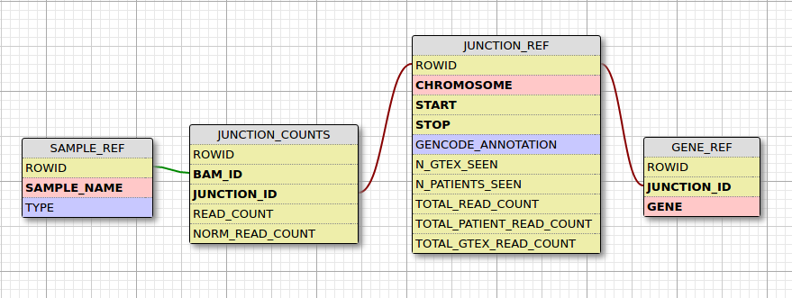

# 1. Installation
1. Clone [crt](https://github.com/naumenko-sa/crt), [cre](https://github.com/naumenko-sa/cre), and [bioscripts](https://github.com/naumenko-sa/bioscripts) to
`~/crt`, `~/cre`, and `~/bioscripts`.
2. Set PATH: `export PATH=~/crt/scripts:~/cre/scripts:~/bioscripts/scripts` in ~/.bash_profile.
3. Install [bcbio_nextgen](https://github.com/bcbio/bcbio-nextgen), set PATH and PYTHONPATH:
```
export PATH=/path/bcbio/anaconda/bin:$PATH
export PYTHONPATH=/path/bcbio/anaconda/lib/python2.7
```

# 2. Run bcbio with ~/crt/config/crt.bcbio.default.yaml.
1. name sample SX_case-N-tissue, i.e. S101_55-1-F.
2. create project/input, project = SX, input files [sample]_1.fq.gz, [sample]_2.fq.gz.
3. `crt.prepare_bcbio_run.sh $project`.
4. (optional) add strandedness: firststrand for stranded samples.
5. ```qsub ~/cre/scripts/bcbio.pbs -v project=project```
Don't trim reads to save all data and delete (acrhive) fastq files.

# 3. Small variant report
1. Copy SX-gatk-haplotype-annotated.vcf.gz from bcbio_output/final.
2. Annotate variants:  
`qsub ~/cre/cre.vcf2cre.sh -v original_vcf=SX-gatk-haplotype-annotated.vcf.gz,project=SX`
3. Generate reports (SX dir prepared by step2 should be ./SX, i.e. in the current dir):  
`qsub ~/cre/cre.sh -v family=SX,type=rnaseq` - including rare intronic variants.  
`qsub ~/cre/cre.sh -v family=SX` - only rare coding/splicing variants.

# 4. Gene expression outlier analysis (RPKM)
1. ```qsub ~/crt/crt.feature_counts.sh -v bam=file.bam``` - counts for RPKM calculation in R.
2. Use read.feature_counts_dir() from ~/crt/crt.utils.R to create RPKM matrix.
3. crt.GonorazkyNaumenko2018.R - functions for muscular project.

# 5. Isoform expression outlier analysis (TPM)

# 6. Splicing analysis (based on [MendelianRNA-seq](https://github.com/berylc/MendelianRNA-seq))
## 1. (For every bam file including controls). Get junctions from a bam file with samtools:  
```qsub ~/crt/scripts/crt.bam2junctions.pbs -v bam=file.bam```,  
output: file.bam.junctions.txt

## 2. Prepare reference database 
Load GENCODE junctions: 
```
python3 ~/crt/AddJunctionsToDatabase.py \
--addGencode \
-transcript_model=~/crt/gencode.comprehensive.splice.junctions.txt
```
output: SpliceJunction.db

Load junctions from control samples: 
`qsub ~/crt/crt.load_junctions.pbs -v bam=file.bam`
output: SpliceJunction.db

## 3. (For every sample) Load junctions from a sample to SpliceJunctions.db
`qsub ~/crt/crt.load_junctions.pbs -v bam=file.bam`

## 4. Filter rare junctions: `qsub ~/crt/crt.filter_junctions.sh -v bam=file.bam`

##5. Dependencies

	1. ~/crt/genes.bed - protein coding genes. 
	
	2. ~/crt/gencode.comprehensive.splice.junctions.txt - junctions from gencode v19.

	3. [Python 3.5.2]

	4. Python [CIGAR string library](https://pypi.python.org/pypi/cigar/0.1.3) by Brent Pedersen

	5. sqlite3 Python library SQLite3 version >=3.11.0.
	```
	import sqlite3
	print (sqlite3.sqlite_version_info)
	```

	6. Differences from Beryl Cumming's original MendelianRNA-seq

- junctions are stored in a database. We process GTEx controls once and reuse the database.

- SpliceJunctionDiscovery has been rewritten in Python
- CIGAR string parsing is handled by a function called parseCIGARForIntrons() whereas before CIGAR strings were handled by piping through multiple bash tools. As a result of improper parsing using bash tools, junction start and/or stop positions were not reported properly (e.x. 1:100-200*1D30 represents an alignment that should really be 1:100-230 or 1:100-231)
- Transcript_model annotation and flanking have been implemented using database logic
- All information produced by SpliceJunctionDiscovery is stored in a database instead of text files. This allows the user to utilize previously computed results instead of having to run the entire pipeline again when a new sample needs to be analyzed.
- Transcript_model annotation now discriminates between 'START' and 'STOP' instead of 'ONE'. In addition, there is a new annotation, called 'EXON_SKIP' which denotes the event of exon skipping. This is done by checking to see if the reported 3' and 5' positions from a sample's junction belong to different transcript_model junctions.
- Normalization of annotated junctions now considers read counts from all junctions that have at least one annotated splice site as the denominator whereas before only "BOTH" annotated junctions were used

### 4.6 Footnotes

### A junction in multiple gene regions
A single gene region can encompass partial or whole regions of other genes. Thus, the same junction can appear in 2 different gene text files in a sample folder generated by SpliceJunctionDiscovery. Whether a junction belongs to two or more genes is not always factually correct. However, for the sake of inclusion and for the fact that this rarely happens, this edge case has been accounted for in AddJunctionsToDatabase.py in two ways: 

	1. The mapping of a single junction to multiple genes has been done with the table GENE_REF
	2. If the script encounters the same junction in a sample more than once, it will utilize the result with the highest read count for read count and normalized read count and will discard the other.

### Splice site flanks and annotation
A +/- flanking region is considered when annotating the 5' and 3' positions of sample junctions to increase the number of annotated junctions. This value is specified by the -flank parameter (default 1). There is an option to not use flanking at all (-flank 0).

## 6. References and resources
* [Original MendelianRNA-seq by Beryl Cummings](https://github.com/berylc/MendelianRNA-seq)
* [Modification by Dennis Kao](https://github.com/dennis-kao/MendelianRNA-seq-DB)
* [Article: Cummings et al. 2017](http://stm.sciencemag.org/content/9/386/eaal5209) 
* [Manual](https://macarthurlab.org/2017/05/31/improving-genetic-diagnosis-in-mendelian-disease-with-transcriptome-sequencing-a-walk-through/)
* http://www.rna-seqblog.com

## 7. List of scripts
- crt.gonorazky.naumenko.2018 - human bulk RNA-seq to solve Mendelian cases: clustering, outlier analysis, coverage, plots, splicing analysis
- crt.nishani2018.R - bulk RNA-seq of cancer stem cell experiment
- crt.utils.R - common function for RNA-seq analysis
- crt.tropak2018.R - bulk RNA-seq, clustering, DE in mouse
